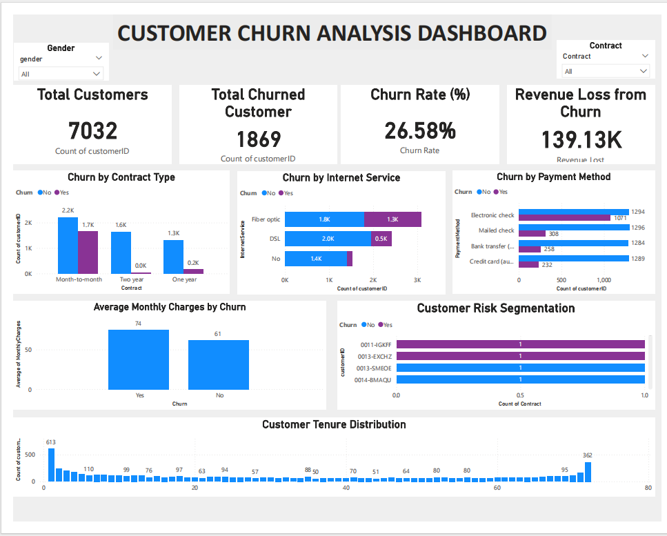
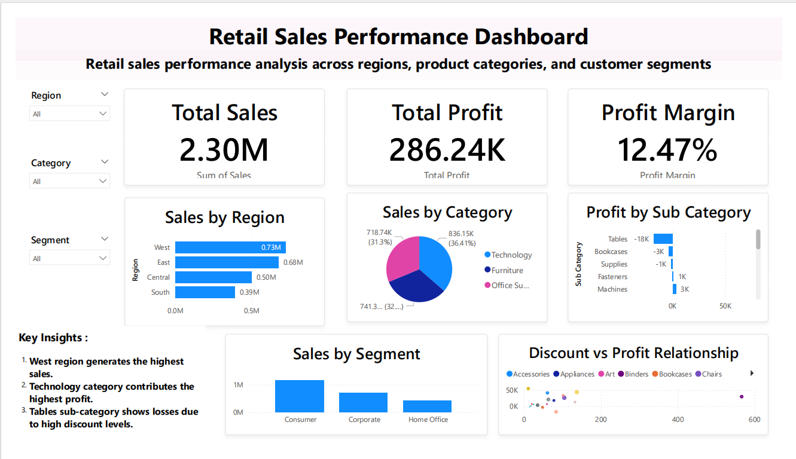

# Akash | Data Analyst Portfolio

Welcome to my Data Analytics Portfolio.
This repository showcases projects demonstrating data cleaning, analysis, and dashboard development using Excel, SQL, Python, and Power BI.

## Skills

* Microsoft Excel
* SQL
* Python (Pandas, Matplotlib, Seaborn)
* Power BI
* Data Cleaning
* Exploratory Data Analysis (EDA)
* Dashboard Development
  
## Projects

### 1. Customer Churn Analysis

Analyzed telecom customer data to identify factors influencing customer churn.

Tools Used: Excel, SQL, Python, Power BI

Key Insights:

* Customers with month-to-month contracts churn more frequently.
* Higher monthly charges increase churn probability.

### 2. HR Employee Attrition Analysis

Analyzed employee attrition patterns to identify workforce retention challenges.

Tools Used: Excel, SQL, Python, Power BI

Key Insights:

* Sales department has higher employee attrition.
* Employees working overtime are more likely to leave.

### 3. Retail Sales Performance Analysis

Analyzed retail sales data to understand revenue patterns and discount impact.

Tools Used: Excel, SQL, Power BI

Key Insights:

* High discounts reduce profit margins.
* Certain product categories generate higher revenue.

## Tools & Technologies

Excel | SQL | Python | Power BI | GitHub

## Dashboard Preview

### Customer Churn Dashboard 
 

### HR Employee Attrition 

### Retail Sales Dashboard

